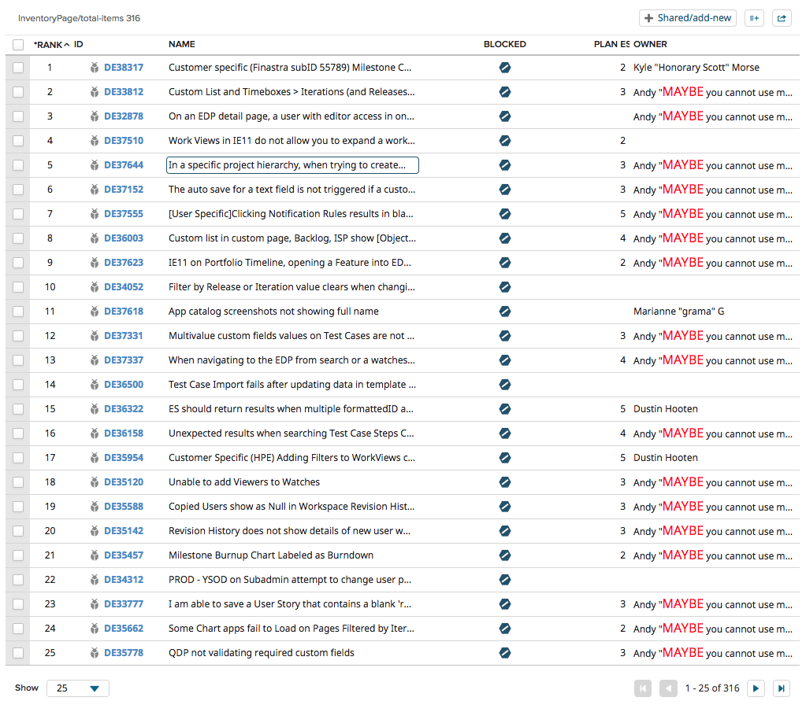

# Data Table

This example app is based on Rally App SDK 3 and demonstrates using the DataTableWithToolbar component.

## Installation and Settings
The app is installed as a Custom HTML App ([see help documentation](https://help.rallydev.com/custom-html))
